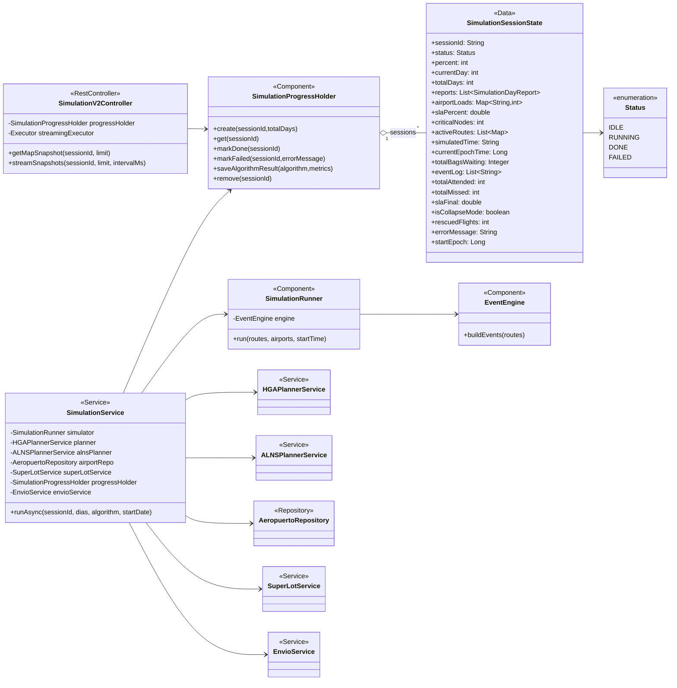
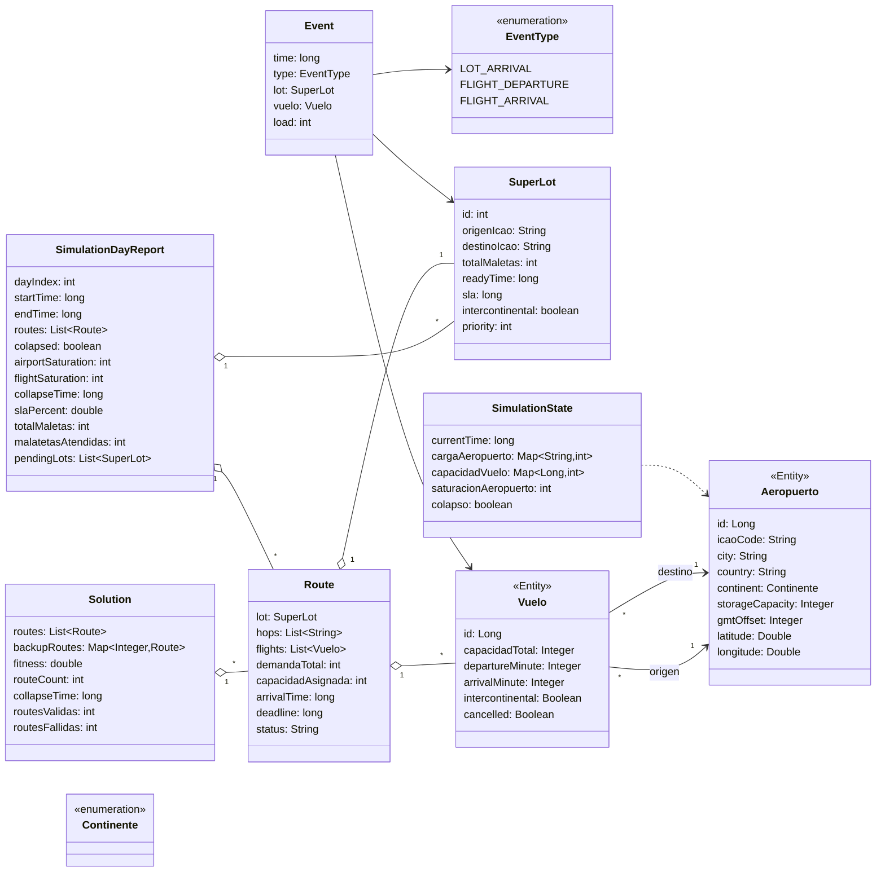
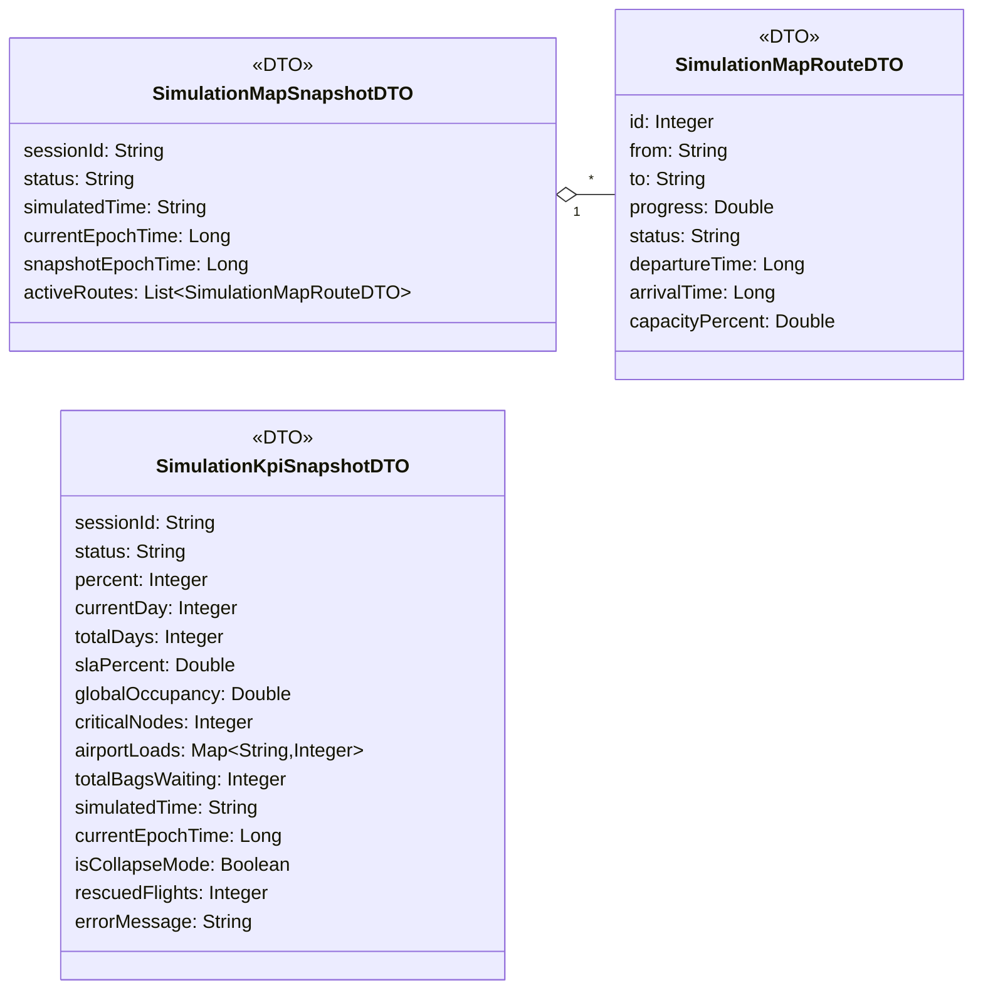
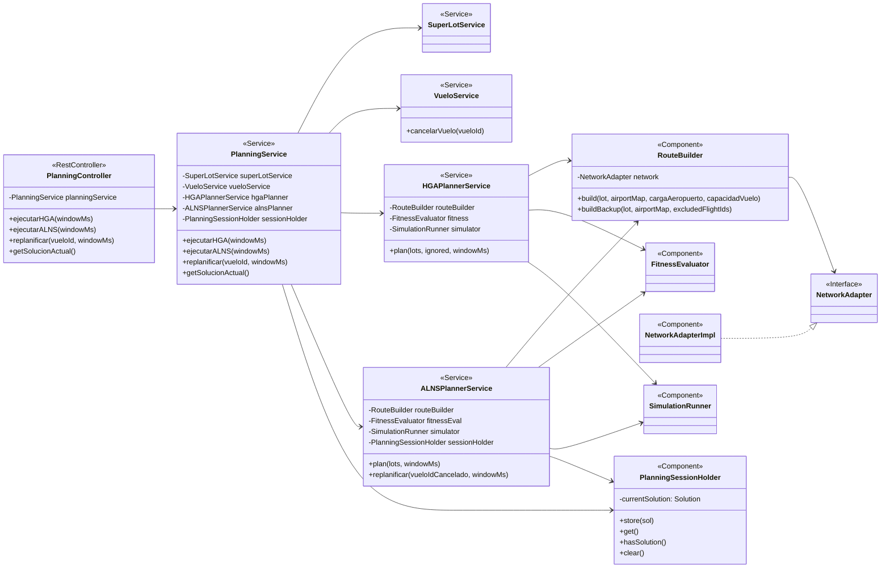
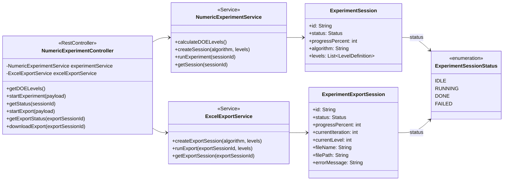

# 27.dis.diag.clases.v01.md

## 1. Control de Versiones
| Versión | Fecha | Descripción |
|---|---|---|
| v01 | 23-04-2026 | Versión inicial — Diagrama de Clases |
| v02 | 06-05-2026 | Actualización exhaustiva: Diagrama de Clases Backend y Árbol de Dependencias de React Hooks (Frontend). |

## 1.1 Convención TO-BE vs AS-IS

Este documento se redacta con dos vistas complementarias:

1. **TO-BE (Diseño objetivo):** cómo se define el modelo y los subsistemas a nivel de diseño.
2. **AS-IS (Implementación actual) y mapeo:** cómo se materializa hoy en el código fuente.

Regla: los diagramas y tablas indican explícitamente si son TO-BE o AS-IS para evitar confusiones.

## 2. Modelado de Objetos y Estructuras (Arquitectura Híbrida)

En arquitecturas asíncronas modernas como Tasf.B2B, el "Diagrama de Clases" tradicional se bifurca: el **Backend** obedece a Paradigmas Orientados a Objetos (OOP) estrictos con inyección de dependencias (Spring), mientras que el **Frontend** obedece a un Paradigma Funcional y Reactivo guiado por *Hooks*.

### 2.0 Vista TO-BE (Diseño objetivo)

El diseño objetivo formaliza los subsistemas reales (Simulación+Streaming, Planificador HGA/ALNS y Experimentación Numérica) y define un estado unificado de sesión para consumo UI.

### 2.1 Backend — Paquete de Dominio y Simulación (TO-BE)

| Clase / Entidad | Estereotipo | Atributos/Métodos Críticos | Rol Arquitectónico |
|---|---|---|---|
| `SimulationSessionState` | `@Data` (Objeto en Memoria) | `sessionId`, `status`, `airportLoads`, `activeRoutes` | Actúa como el origen de verdad *Stateful* de una simulación asíncrona particular. |
| `SimulationProgressHolder` | `@Component` (Singleton) | `Map<String, SimulationSessionState> sessions;` `create()`, `get()`, `remove()` | Gestor de concurrencia. Alberga todos los estados activos sin bloquear la base de datos. |
| `SimulationV2Controller` | `@RestController` | `streamSnapshots(sessionId, limit, intervalMs)` | Controlador de borde que emite el objeto `SseEmitter` hacia el exterior. |
| `SimulationService` | `@Service` | `runAsync(sessionId, algorithm)` | Orquestador de negocio. Lanza Hilos separados del API Thread principal. |
| `HGAPlannerService` | `@Service` | `plan(lots, windowMs)`, backup routes | Motor metaheurístico HGA para planificación base y precálculo de rutas de respaldo. |
| `ALNSPlannerService` | `@Service` | `plan(lots, windowMs)`, `replanificar(vueloId, windowMs)` | Motor metaheurístico ALNS para planificación y replanificación ante cancelaciones. |
| `SimulationKpiSnapshotDTO` | DTO (Record / Lombok) | `globalOccupancy`, `airportLoads`, `criticalNodes` | Molde inmutable para transportar métricas por la red. |

### 2.2 Frontend — Árbol de Jerarquía Reactiva (TO-BE)

Debido a que React/Vite descarta el uso de clases UI puras en favor de Hooks Funcionales, documentamos la "jerarquía de clases" como la "Jerarquía de Dependencia de Estados".

| Hook / Componente Funcional | Naturaleza | Dependencias Inyectadas | Propósito Lógico |
|---|---|---|---|
| `api.js` | Helper Funcional | `fetch`, variables de entorno `VITE_API_ORIGIN`. | "Clase Utilitaria" estática. Provee `apiFetch` y unifica la URL base del backend. |
| `useControlTowerController.js` | Custom Hook | `useState`, `useEffect`, `EventSource`, `apiFetch`. | Actúa como el **Controller** principal de MVC. Mantiene el Estado Singleton virtual (rutas y kpis). Engloba la conexión SSE persistente e hidrata el UI. |
| `App.jsx` | Shell / Componente Raíz | `useControlTowerController`, Router | Contenedor de la Torre de Control. Ensambla paneles, escenarios y el mapa. |
| `WorldMap.jsx` | Presenter (Mapa SVG) | `react-simple-maps` | Interpreta el estado espacial (`activeRoutes`, `airportLoads`) y lo dibuja en el mapa. |
| `useNumericExperiment.js` | Custom Hook | `apiFetch` | Aisla la lógica asíncrona y descargas binarias `.xlsx` independientes de la simulación gráfica. |

### 2.3 Enumeraciones del Dominio Estratégico

| Enumeración Backend | Valores Implementados | Contexto de Negocio |
|---|---|---|
| `Status` (TO-BE unificado) | `IDLE`, `RUNNING`, `FAILED`, `DONE` | Estado formal de sesión para UI/telemetría. `IDLE` representa "sin ejecución". |
| `SimulationProgressHolder.Status` (AS-IS) | `RUNNING`, `FAILED`, `DONE` | Implementación actual del simulador: no modela `IDLE` en backend; el idle vive en UI (`simState`). |
| `ExperimentSession.Status` / `ExperimentExportSession.Status` (AS-IS) | `IDLE`, `RUNNING`, `FAILED`, `DONE` | Implementación actual de experimentación numérica y exportación: sí incluye `IDLE`. |
| Tags de escenario (TO-BE) | `VIVO`, `PERIODO`, `COLAPSO` | Etiquetas de UI/negocio para parametrizar ejecución. En AS-IS se materializa como `activeTab` y flags (`isCollapseMode`). |
| Tags de algoritmo (TO-BE) | `HGA`, `ALNS` | Etiqueta para reportes y comparación. En AS-IS se usa como string (`algorithm`) y como `selectedAlgorithm` en frontend. |

### 2.4 Diseño de Patrones Formales
* **Observer:** Visible en el canal EventSource. El Frontend suscribe listeners inmutables (`addEventListener("kpi")`), delegando al Backend la potestad de avisar cambios.
* **Singleton:** `SimulationProgressHolder` es instanciado una sola vez por el contenedor Spring IoC, evitando colisiones de memoria entre llamadas HTTP concurrentes al vuelo.
* **DTO Puros:** `SimulationMapSnapshotDTO` carece de comportamientos. Aislar datos de lógica permite enviar objetos puros de Java directo al Serializador de Jackson hacia JSON para ser consumidos por React.

## 3. Diagramas UML (Mermaid)

Los diagramas se segmentan por subsistema para mantener legibilidad. Cada bloque es autocontenido y puede exportarse a SVG/PNG para insertarse en Word.

### 3.1 Backend — Orquestacion y Estado de Simulacion

### 3.2 Backend — Dominio de Rutas y Eventos

### 3.3 Backend — DTOs de Streaming SSE

### 3.4 Backend — Planificador (HGA/ALNS) y Replanificación

### 3.5 Backend — Experimentación Numérica (DoE) y Exportación Excel

## 4. Referencias
* Componentes de software: `DISENIO SOFTWARE/25.dis.componentes.v01.md`
* Arquitectura: `DISENIO SOFTWARE/24.dis.arq.solucion.v01.md`
